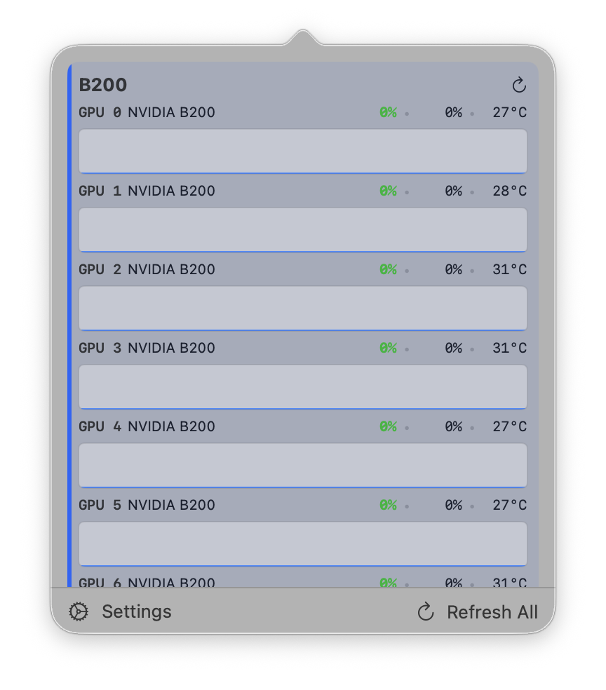

# Remote GPU Monitor

A lightweight macOS menubar app for monitoring NVIDIA GPUs on remote machines over SSH.



## Features

- **Menubar status bar** — live utilization bar graph per GPU, colored green/yellow/red
- **Detail popover** — per-GPU utilization, memory, temperature, and mini charts with history
- **SSH-native** — uses your existing `~/.ssh/config` and ssh-agent; no server-side agent needed
- **Multi-node** — add multiple remote GPU machines and switch between them
- **Configurable polling** — adjust refresh interval from settings
- **Password & key auth** — supports SSH keys and password-based auth (stored in Keychain)

## Requirements

- macOS 14+
- Remote machine(s) with `nvidia-smi` installed
- SSH access to the remote machine(s)

## Installation

Build from source in Xcode:

```
git clone https://github.com/shg8/remote_gpu_mon.git
open remote_gpu_mon.xcodeproj
```

Press **Cmd+R** to build and run.

## Usage

1. Launch the app — it appears as a menubar icon
2. Click the icon and open **Settings**
3. Add a remote node (hostname, SSH user, auth method)
4. The menubar shows a live bar graph; click it for the detail panel

## How It Works

Connects via `/usr/bin/ssh` (honoring your SSH config) and runs `nvidia-smi` queries to fetch GPU utilization, memory usage, temperature, and running processes. No dependencies or agents are required on the remote machine.
